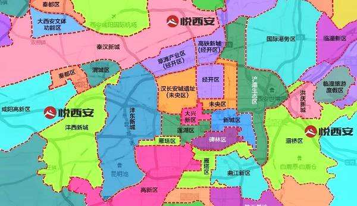

	   受杭州楼市知识项目的启发（https://github.com/houshanren/hangzhou_house_knowledge），
	   在原有结构上，重新整理了西安的相关内容。
      --图片来源于公开网络，侵删
      --数据不一定准确，大家可以一起维护
      --所有内容仅做参考

## <a name="id-西安房产-一：西安的区域组成">一：西安的区域组成</a>

### 1.<a name="西安区域板块图">西安区域板块图</a>

### 2.<a name="西安主城区域行政图">西安主城区域行政图</a>
缺图！
### 3.<a name="西咸其他区域整体图">西咸其他区域整体图</a>
缺图！
### 4.<a name="近年西安热门区域分布图">近年西安热门区域分布图</a>
缺图

## <a name="id-西安房产-二：各个区域的前世今生及展望">二：各个区域的前世今生及展望</a>
### 1.<a name="高新版块">高新版块</a>
### 2.<a name="曲江版块">曲江版块</a>
### 3.<a name="浐灞版块">浐灞版块</a>
### 4.<a name="沣东版块">沣东版块</a>
### 5.<a name="等等">等等</a>

## <a name="id-西安房产-三：城中村及拆迁情况">三：城中村及拆迁情况</a>
### 1.<a name="大兴立交区域">大兴立交周围</a>
### 2.<a name="鱼化寨区域">鱼化寨区域</a>
### 3.<a name="等等">等等</a>

## <a name="id-西安房产-四：西安土拍情况">四：西安土拍情况</a>

## <a name="id-西安房产-五：西安房企负面新闻清单">五：西安房企负面新闻清单</a>
